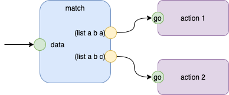

# Functional Programming - Pattern Matching

## Takeaway - Pattern Matching

- pattern matching
- text replacement and manipulation

## Pattern Matching

Pattern matching is *parsing*.

Currently, the easiest parsing method is PEG.

My favorite variant of PEG is Ohm-JS.

### Compile Time vs Runtime Pattern Matching

It is possible to specify patterns at compile time.

Most patterns, though, cannot be matched against data until runtime.

A few patterns can be matched at compile-time, e.g. `if (true) then ... else ... end if`.  These become the subject of compiler optimizations.

### CASE on Data, CASE on Type, CASE on State

CASE is a primary form of pattern matching.

CASE on *Data* is parsing.

CASE on *Type* is OOP.

CASE on *State* is History[^pm1].

[^pm1]: History can be implemented as State Machines, StateCharts, Actors.

### FP Pattern Matching

Modern forms of FP (functional programming) use pattern matching.

Let's look at a simple example from https://docs.racket-lang.org/reference/match.html:

```
> (match <runtime data>
    [(list a b a) <action details>]
    [(list a b c) <action details>])

```

Pattern matching in FP consists of a set of pattern-action pairs.

The pattern-matcher syntax directs *control-flow* (something akin to *if-then-else*).

This pattern match can be abstracted with a diagram of components, as in Fig. 1



The *Match* portion does not need to use the same syntax as the *action* portions. The *Racket* manual shows some 50+ variations of syntax that are considered valid in the *match* section.  *Racket* attempts to create a single syntax for all matches and all actions.  This is uneccessary and leads to 

- wasting time/wasting brain-power, and,
- accidental complexity.

Note that Fig.1 shows a simple matcher.  It matches for one of two patterns[^pm2] This is an example of the use of SCNs (Solution Centric Notations) and *isolation*.  The diagram is tuned for only the problem-at-hand and, we *cannot* care if the matching language supports other kinds of patterns (that is merely a detail).

The diagram is more expressive than the 3-line Racket program listed above it.  YMMV.

[^pm2]: plus a default which is not shown. 

## Text Manipulation

Functional programming, and mathematical notation, imposes the restriction that there can be no side-effects.

Immutability is not simply a *desired feature* but it is a *requirement* of the mathematical notation.

Full *isolation* would make the immutability requirement moot. If components are fully isolated, you can allow internal mutation, and, you can build components that are arbitrarily complex.


