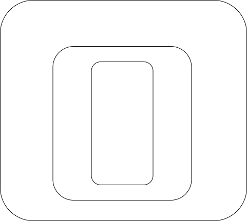
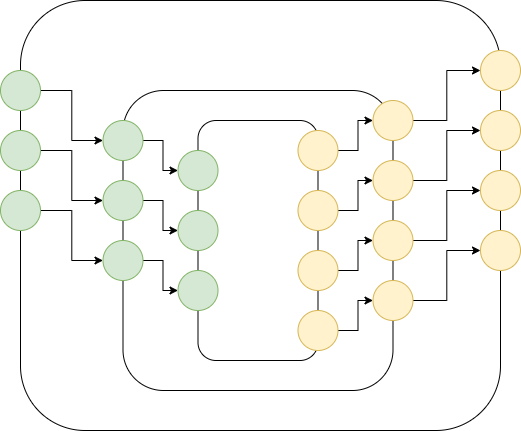

# Hierarchy

## Main Takeaway

- relativeness

## Relative Organization of Code

- Most advances in language design have made some aspect of the language *more relative*, 
	- e.g. scoping made variables relative to containing functions, 
	- e.g. parameter lists make bound variables relative to containing functions (the callees)
	- first-class functions allow treating code snippets as data, then nest them (make them relative to the callee)
	- PATHs in UNIX® allow relative references to locations and code
	- Java-like component naming paths are relative to a root path (used, also, in Go)
	- imports statements in modern languages are relative to other components
- ASCII Art imitates diagrams of nested components

## Diagrams

### Relative Structure

         

### Relative Structure With Explicit Ports

