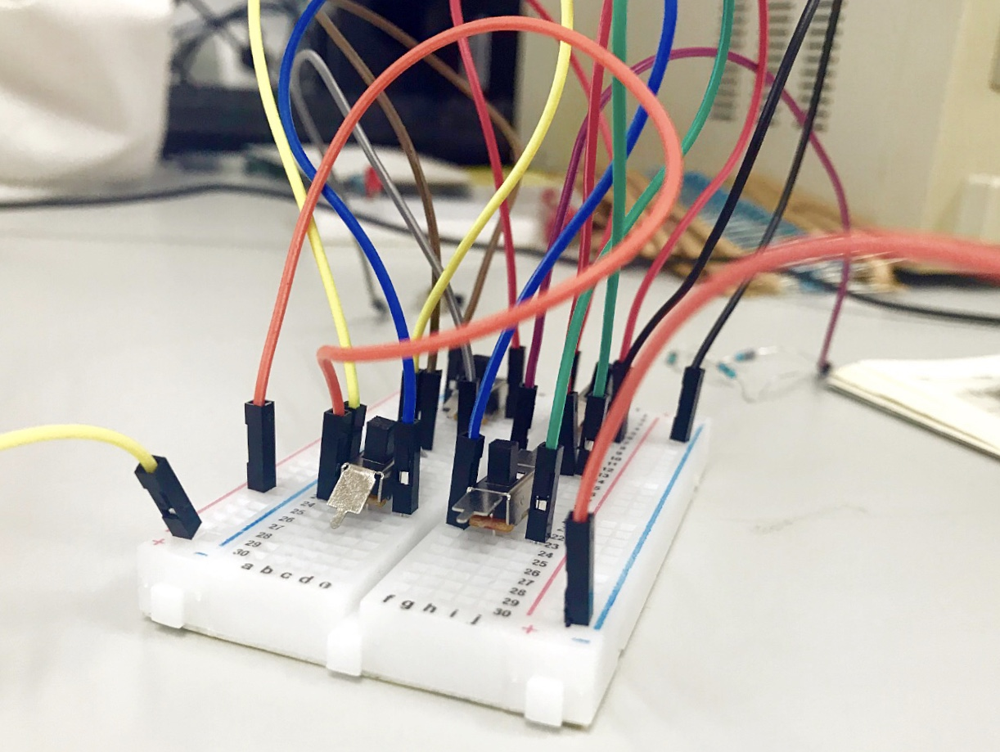

## Breadboards (Advanced Programming)

Breadboards were used to allow moving and reconnecting wires without the need to solder.[^pengxh]

{width: "70%"}

[^pengxh]: https://commons.wikimedia.org/wiki/File:Breadboard_in_our_experiment.jpg

This was faster than programming by soldering, but, it was more expensive.
