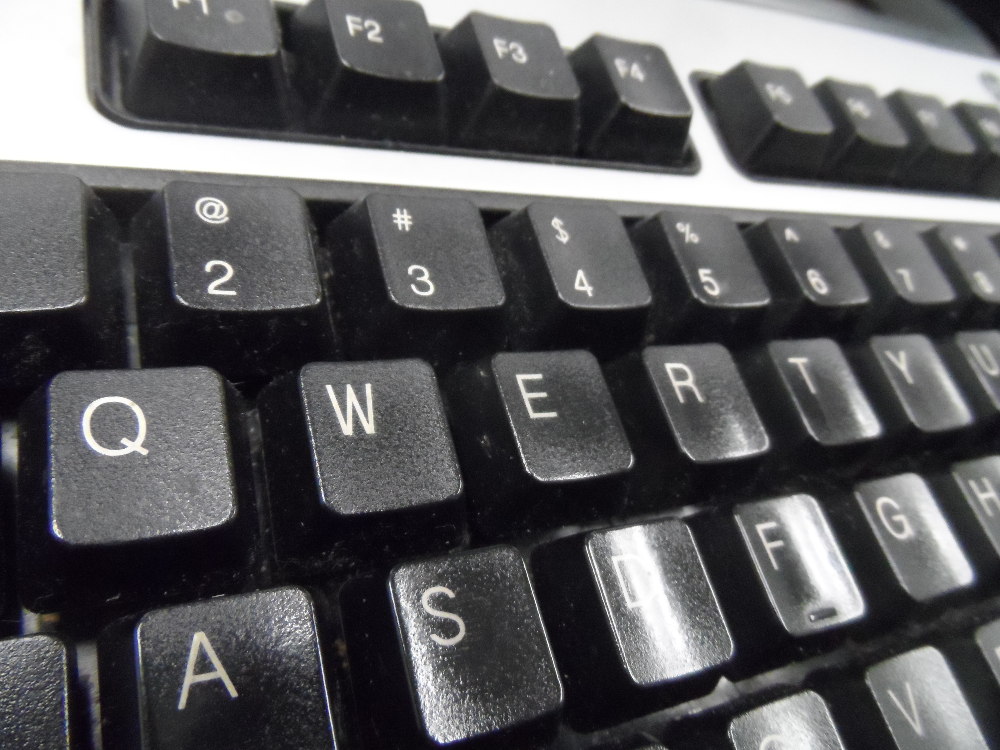
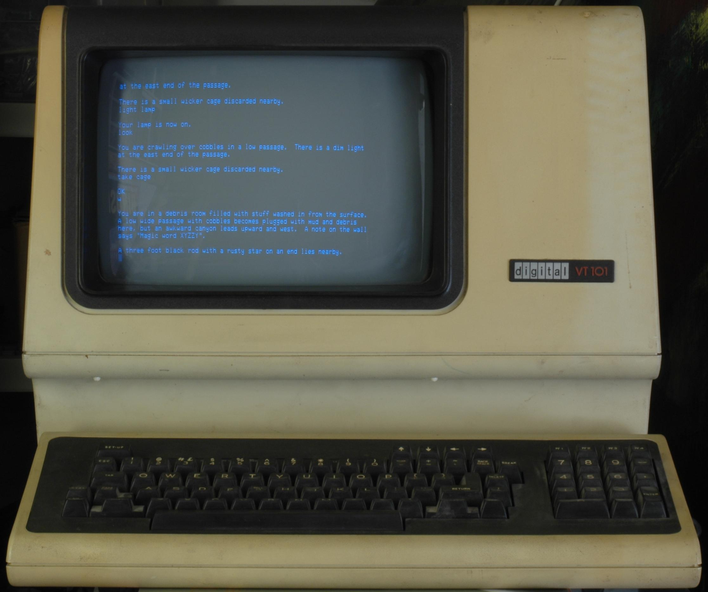

## HCI - Human Computer Interfaces - Keyboards and Displays

Problem #1: Ultra-small switches were too small for humans to interact with.

Problem #2: Ultra-small switches produced results that consisted of electrical impulses.  The human body does not have precision sensors for detecting tiny electrical impulses.

### Solution - Keyboards
Invent human-sized banks of switches - called QWERTY keyboards.[^mb]

{width: "60%"}

[^mb]: https://commons.wikimedia.org/wiki/File:Qwerty_Keyboard.JPG

### Solution - Displays

Invent mapping from tiny electrical impulses to larger, human-sized displaying units.[^vt100]

{width: "60%"}

[^vt100]:https://commons.wikimedia.org/wiki/File:Vt100-adventure.jpg
Printers (display results on paper).

Video screens.  Display results on thin films of phosophorous painted onto the backside of glass tubes.

LED screens. Display results on grids of tiny light bulbs, called light emitting diodes.

Teletypes: Combination of printer and QWERTY keyboard as single units.[^tty]

{width: "60%"}

[^tty]:https://upload.wikimedia.org/wikipedia/commons/9/9e/Teletype.jpg
