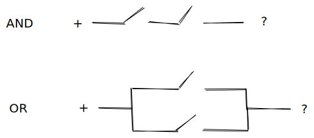

## Toggle Switches (Advanced Programming)

Toggle switches were used to replace soldering of wires.[^jz]

{width: 40%}

[^jz]:Jason Zack at en.wikipedia, CC BY-SA 2.5 <https://creativecommons.org/licenses/by-sa/2.5>, via Wikimedia Commons

Revelation: toggle switches had 2 states "OFF" and "ON".

Revelation: arranging toggle switches in sequential and parallel combinations produced physical equivalents of Boolean Logic (AND and OR functionality).

